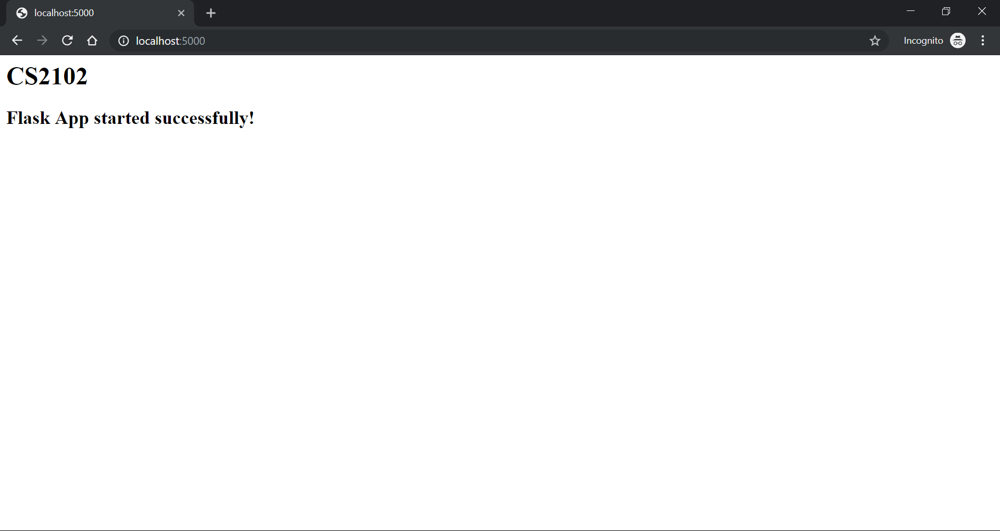
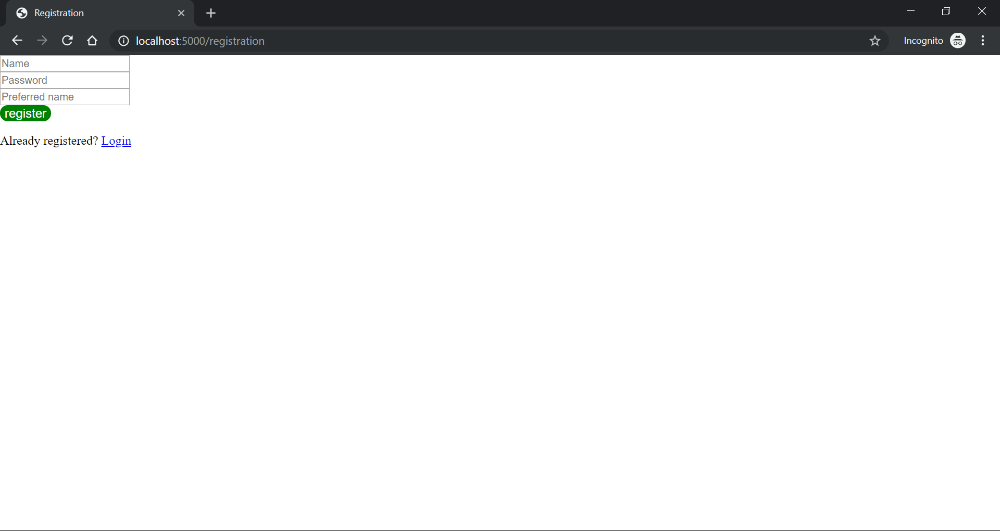
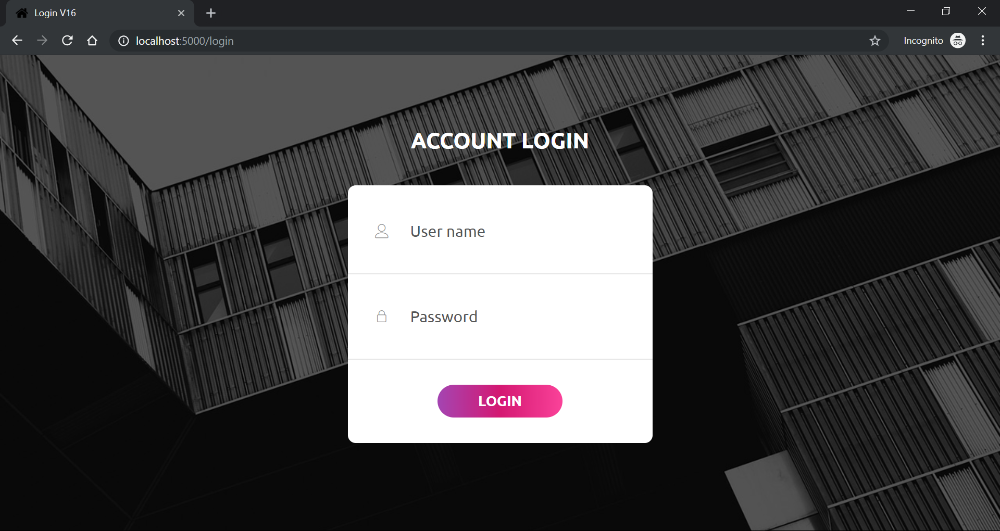

# CS2102 Python Flask Setup Guide

The objective of this guide is to let you start with your first database project using Windows. 
This guide uses Flask + PostgreSQL for back-end and Bootstrap for styling at the front-end. 
You are welcomed to use any other back-end/front-end pairs of your choosing. 
We recommend Flask framework if you would like to program in Python. 
With Flask, you can quickly spin off a web application. 
It is also fully compatible with regular web dev stack such as `html`, `js` and `css`. 
It is possible to develop without touching javascript at all but the form of interaction you can achieve will be restricted. 
For example, you won't be able to build dynamic pages as compared to nodejs stack.
Nevertheless, being able to build static web pages is enough for this project. 

## Toolkit Installation

### Browser
This guide contains screenshots taken from Chrome but it should work for any other commonly-used browser.
There may be some minor differences in terms of alignments and element rendering,
so it is encouraged that once you decided to use a browser for testing, stick to it
all the way and standardize across the team.

### PostgreSQL
This guide assumes PostgreSQL has already been installed. If not, follow the separate installation guide for it to set up PostgreSQL.

Once you have installed PostgreSQL and created a database, run `init.sql` to set up the database.

### Python
Python 3.7.2 will be used in this guide, but it should work with any Python>=3.5.
However, if you want to use Python2, you may need to make adjustments to some of the sample scripts provided.
Also, there's no guarantee that this guide can work with Python2.

You can download Python from [here](https://www.python.org/downloads/).

Make sure to include installation of `pip` as well, as it will be used for downloading packages.

### Python Packages
The packages needed to run the scripts provided in this guide can be downloaded and installed via:

`pip install -r /<...>/cs2102-python-flask-setup-guide/requirements.txt`

Replace `<...>` with the corresponding path to `cs2102-python-flask-setup-guide` folder on your computer.

Here is a list of flask-related packages and its main usages:
* flask
    * This package handles routing, request handling and HTML template rendering.
* flask-login
    * This package provides login-related utility functions.
* flask-sqlalchemy
    * This package provides ORM classes that connect the Flask App to database,
    and thus allow you to execute SQL queries in your App.
* flask-wtf
    * This package handles form submission and pass user-entered values into Python objects.
    It also provides other utilities such as validation checks on user-entered fields.

### Pycharm (optional)
Pycharm is a popular IDE for Python.
If you have ticked IDLE when installing Python, you should already have IDLE, which is a simple Python IDE for you to write and run your codes.
However, IDLE is quite minimalist and can be hard to debug if you intend to scale up your project.
Also, you will need to deal with other file types (html, css etc) so using Pycharm can provide you a centralised platform to view everything in one place.

## Sample Web App Walk-through

This should be the directory structure of the files:
* cs2102-python-flask-setup-guide/
    * FlaskApp/
        * static/
            * css/
            * fonts/
            * images/
            * js/
        * templates/
            * index.html
        * app.py
        * models.py
        * views.py
    * init.sql
    * README.md
    * requirements.txt

### Change web app and database configurations
Open `FlaskApp/app.py` and locate the following lines of codes:

```
# Config
app.config['SQLALCHEMY_DATABASE_URI'] = 'postgresql://{username}:{password}@{host}:{port}/{database}'\
    .format(
        username='<username>',
        password='<password>',
        host='localhost',
        port=<port number>,
        database='<database_name>'
    )
```
Replace `<username>`, `<password>`, `<port>`, and `<database_name>` with the actual configuration from your database.
If you are not sure about `<port>` and don't recall changing such a value during initial setup or launching of PostgreSQL server, then it should be `5432` by default.

To run the web service, you must navigate to the `FlaskApp` directory and run the following command:

`python app.py`

You should see some messages showing up in your terminal, with these last few lines:

```
 * Debugger is active!
 * Debugger PIN: 215-554-995
 * Running on http://localhost:5000/ (Press CTRL+C to quit)

```
There may be warnings for SQLAlchemy but you can ignore those.

Go back to `app.py` file and observe the following lines:

```
if __name__ == "__main__":
    app.run(
        debug=True,
        host='localhost',
        port=5000
    )
```

These few lines define the host and port to run the web server.
If you change the port number to `5001`, the message shown at earlier stage will be changed accordingly.
For this walk-through (and also the CS2102 project), there is no need to change these settings.

### Start web app and handle routing
To access the web server, open your favorite web browser (Chrome, Firefox, IE, etc) and enter `localhost:5000/` in the address bar.

Press `Enter` then the page below should show up.



The logic for showing this web page can be found in `views.py`, specifically, these few lines:

```
@view.route("/", methods=["GET"])
def render_dummy_page():
    return "<h1>CS2102</h1>\
    <h2>Flask App started successfully!</h2>"
```

Notice that `localhost:5000` comes from `app.py` setting, and the extra `/` comes from the URL routing mapping in `views.py`.
To add more web pages, you need to add routing to the new page in `views.py` and provide a function that renders the page to show when the URL is accessed.
Most likely you will need to show or render `html` files as web pages. To do that, you need to firstly drop the `html` file(s) into the `FlaskApp/templates` folder. 

### Query database
Locate the following lines in `views.py`:

```
@view.route("/registration", methods=["GET", "POST"])
def render_registration_page():
    if ...:
        ...
        else:
            query = "INSERT INTO web_user(username, preferred_name, password) VALUES ('{}', '{}', '{}')"\
                .format(username, preferred_name, password)
            db.session.execute(query)
            db.session.commit()
            ...
    ...
```

You can easily run plain SQL queries by using `db.session.execute(<query>)`. This initiates a session between the web app and the database. 
For the codes shown above, the database is being updated. Hence you need to commit the changes when you are done, to actually modify the database.

If you are querying database for information, you can simply assign the returned value to a variable like below:

```
result = db.session.execute(<query>)
```

From here, you can iterate through result and get the rows returned.

If you are more comfortable with manipulating python built-in types, you can convert `result` into a list first:

```
result = [r for r in result]

```

There is another way to interact with database without making explicit SQL queries. 
Each table in the database can be modeled as a class, and attributes of the table are then converted to class attributes. 
Such classes are usually called "models" and you can find an example of such class in `models.py`.

```
class WebUser(db.Model):
    username = db.Column(db.String, primary_key=True)
    preferred_name = db.Column(db.String, nullable=True)
    password = db.Coloumn(db.String, nullable=False)
```

You can compare this class with the actual table, `web_user`, to find out how they map to each other. 

With this class, the following codes can achieve the same purpose:
```
# Create new user with plain SQL query
insert_query = "INSERT INTO web_user VALUES('sample_username', NULL, 'sample_password')"
db.session.execute(insert_query)
db.session.commit()
# Create new user with WebUser model
new_web_user = WebUser("sample_username", None, "sample_password")
db.session.add(nwe_web_user)
db.session.commit()

# Get user with username 'sample_username' with plain SQL query
# Note that using this method, you will get a single tuple representing the result instead of WebUser instance
sample_user = db.session.execute("SELECT * FROM web_user WHERE username='sample_username'").fetchone()
# Get user with username 'sample_username' with WebUser model
# Note that using this method, you will get a WebUser instance that represents the given record
sample_user = WebUser.query.filter_by(username='sample_username').first()
```

Although it is possible to set up the whole database using these classes, doing so defeats the purpose of learning SQL in CS2102. 
Hence, you should still rely on writing queries as much as possible, instead of using such wrapper classes.

You may notice that this class has other attributes and method. They are used in the later part of this guide when we talk about how to login users and handle user sessions.

### Render web page and handle forms
Apart from supporting normal `html` markdown, `Flask` has its own syntax support for writing `html` templates which are rendered on-the-fly. 
We will illustrate with registration page.

Switch to your browser and enter `localhost:5000/registration` into address bar. The following page should show up:



The codes responsible for rendering this page are in `views.py`:

```
@view.route("/registration", methods=["GET", "POST"])
def render_registration_page():
    form = RegistrationForm()
    ...
    return render_template("registration-simple.html", form=form)
```

In registration page, users should be able to submit information such as name and password to register for your web app service. 
They do this by making a `POST` request to submit `form`s. In this case, `RegistrationForm` class is used to capture user-entered information. 
All `form`-related classes can be found in `FlaskApp/forms.py`. They should all inherit the base class `FlaskForm` which is imported from `flask_wtf` package.

For example, `RegistrationForm` is defined as below:

```
class RegistrationForm(FlaskForm):
    username = StringField(
        label='Name',
        validators=[InputRequired(), is_valid_name],
        render_kw={'placeholder': 'Name'}
    )
    preferred_name = StringField(
        label='Preferred name',
        validators=[is_valid_name],
        render_kw={'placeholder': 'Preferred name'}
    )
    password = PasswordField(
        label='Password',
        validators=[InputRequired()],
        render_kw={'placeholder': 'Password'}
    )
```

Note that although fields like `username`, `preferred_name` and `password` are not declared as attributes, they can be accessed as if they are attributes. 
To access the actual user-entered values, you can use `form.<field>.data`.

The web page itself is rendered from `FlaskApp/tempaltes/registration-simple.html`. The line that renders the page is:

```
render_template("registration-simple.html", form=form)
```

`form` must be provided as it is used in `registration-simple.html` to render certain fields like below:

```
{{ form.hidden_tag() }}
...
<div class="formField">
{{ form.password }}

    <div class="errorMessage">
    
        <li>{{ error }}</li>
    
    </div>

</div>
...
```

`{{ form.hidden_tage() }}` is always necessary to generate a CSF token, which is a security feature necessary for making `POST` request in `Flask`.
For CS2102, you don't have to worry about it. Just remember to always include it when you render `form`s.

If you want to know what's the actual rendered `html` like, you can right click any empty space on the web page, and select `View page source`.


Observe what happens when you try to enter invalid inputs into the fields and submit. Try to trace back the behaviour from the codes as well.

### Add stylesheets and other static files
This simple web page also uses `css` stylesheet, as you may have found out from these few lines in `registration-simple.html`:

```
<head>
    ...
    <link rel="stylesheet" href="static/css/style-simple.css">
</head>
```

By convention, `css` stylesheets and other static files are stored in corresponding folders inside `FlaskApp/static` directory.
In the later part of this guide, we will illustrate how to use web page templates under this convention.

When you are done, close the browser and stop web server by pressing `CTRL+C` in the terminal running it.

### Use bootstrap templates to beautify
Web developers seldom build web pages from scratch. There are many free and well-designed bootstrap templates available for you to use. 
Here we will demonstrate how one of such bootstrap templates can be used and integrated into our app.

Go to [here](https://colorlib.com/wp/template/login-form-v16/) and download the bootstrap login template.

After unzipping, you should have these files in the folder:


Move `index.html` to `FlaskApp/templates/` and the folders to `FlaskApp/static`.

Open to view `index.html` and locate lines that use external files by searching `href`, `src` and `url`.

Replace the original path with the new relative path to the corresponding files, like below:

```
Before:
<div class="container-login100" style="background-image: url('images/bg-01.jpg');">

After:
<div class="container-login100" style="background-image: url('static/images/bg-01.jpg');">
```

Add the following lines to add routing to this new page to `views.py`:

```
@view.route("/login", methods=["GET", "POST"])
def render_login_page():
    return render_template("index.html")
```

Now start the web app following the instruction in [Start web app and handle routing](#start-web-app-and-handle-routing), 
and then enter `localhost:5000/login` in browser address bar. You should see this login page:



After ensuring the original `html` file can be shown, we need to make changes to `index.html` to integrate `LoginForm` into it.

Locate `LoginForm` in `forms.py` and observe the `render_kw` line:

```
class LoginForm(FlaskForm):
    username = StringField(
        ...
        render_kw={'placeholder': 'Name', 'class': 'input100'}
    )
```

Here, `'class': 'input100'` is added because the original fields in `index.html` have this `class` label, like shown below:

```
<input class="input100" type="text" name="username" placeholder="User name">
```

So to make sure the stylesheet can work properly to format the elements in `html` file, 
you must follow the properties specified as much as possible, especially `class` and `id` properties.

Now proceed to use fields from `LoginForm` to replace fields in original `index.html`. For example:

```
Replace:
<input class="input100" type="text" name="username" placeholder="User name">

With:
{{ form.username() }}
```

And remember to include `{{ form.hidden_tag() }}` right below the following line:

```
...
<form class="login100-form validate-form p-b-33 p-t-5">
    {{ form.hidden_tag() }}
...
```

Since `POST` request is used to submit the form, `formmethod` property must be specified to `"post"` for `button`, like below:

```
Replace:
<button class="login100-form-btn">

With:
<button class="login100-form-btn" formmethod="post">
```

Then modify `views.py` to feed `LoginForm` instance into template rendering:

```
@view.route("/login", methods=["GET", "POST"])
def render_login_page():
    form = LoginForm()
    if form.is_submitted():
        print(form.username.data)
        print(form.password.data)
    ...
    return render_template("index.html", form=form)
```

Restart the web app and navigate to login page. The same page should show up but this time, you can enter some information 
in the two fields and submit. The information you entered should be printed out in the console or terminal that's running 
the web app.

### Handle login and user session
We have illustrated how to use bootstrap login template but login is more than showing a page of successful login.

Using `current_user` from `flask-login` package, you can retrieve information about the current user browsing the website. 
Before login, a user is an anonymous user and cannot access URLs that have been decorated with `@login_required`. 
You can find one such URL in `views.py` by searching for this decorator.

On the other hand, users who have logged in will be able to access the URL. Hence, you need to change the status of the current user 
when he or she has successfully logged in. An example has already been provided in `views.py`. You can find by searching `load_user`.

This is where `WebUser` we defined earlier becomes important, as `flask-login` requires the model class that represents the current user 
to implement certain class attributes and methods.

For more information, you can look up [flask-login documentation](https://flask-login.readthedocs.io/en/latest/).

## Additional Information

* [flask](https://flask.palletsprojects.com/en/1.1.x/)
* [flask-login](https://flask-login.readthedocs.io/en/latest/)
* [flask-sqlalchemy](https://flask-sqlalchemy.palletsprojects.com/en/2.x/)
* [flask-wtf](https://flask-wtf.readthedocs.io/en/stable/)
